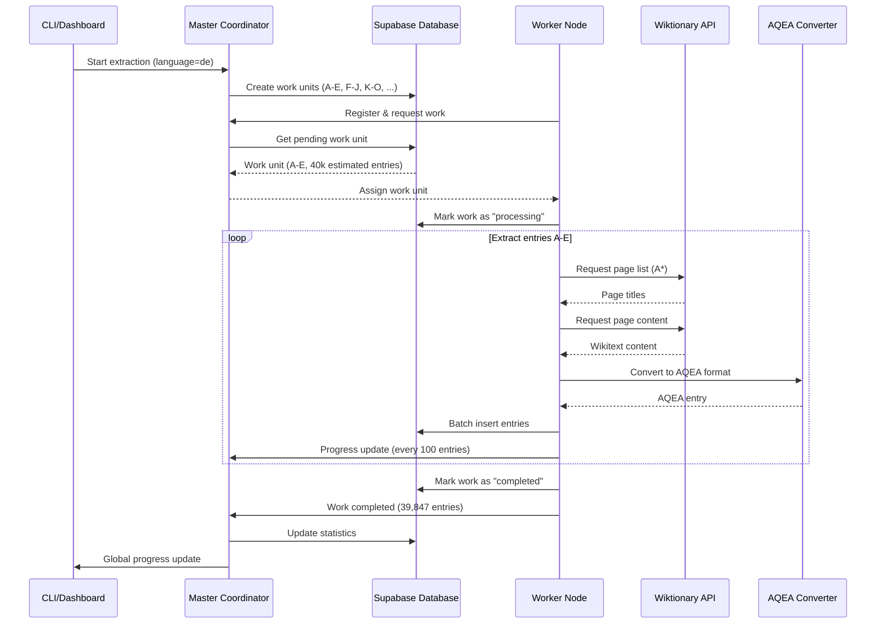

# 🏗️ AQEA Distributed Extractor - Architecture

> **Universal Language Data Extraction at Scale**
> 
> A distributed system for extracting language data from multiple sources (Wiktionary, PanLex, etc.) and converting it to the **AQEA 4-byte addressing format** for universal knowledge representation.

---

## 📋 Table of Contents

1. [What is AQEA?](#what-is-aqea)
2. [The Problem We Solve](#the-problem-we-solve)  
3. [Why Distributed Extraction?](#why-distributed-extraction)
4. [System Architecture](#system-architecture)
5. [Core Components](#core-components)
6. [Data Flow](#data-flow)
7. [Cloud Database Architecture](#cloud-database-architecture)
8. [Deployment Models](#deployment-models)
9. [Performance & Scalability](#performance--scalability)
10. [Cost Analysis](#cost-analysis)
11. [Getting Started](#getting-started)
12. [API Reference](#api-reference)
13. [Monitoring & Operations](#monitoring--operations)
14. [Roadmap](#roadmap)

---

## 🎯 What is AQEA?

**AQEA (Advanced Quantum Epistemic Architecture)** is a universal addressing system that assigns **unique 4-byte addresses** to every piece of knowledge in the world.

### Format: `AA:QQ:EE:A2`
- **AA** = Domain (e.g., 0x20 = German, 0x21 = English)
- **QQ** = Category (e.g., 0x01 = Noun, 0x02 = Verb)  
- **EE** = Subcategory (e.g., 0x01 = Nature, 0x02 = Animals)
- **A2** = Element ID (unique within subcategory)

### Example AQEA Addresses
```
0x20:01:01:01 = German word "Wasser" (water)
0x21:01:01:01 = English word "water"  
0x04:01:00:01 = Chemical element H₂O
0x30:01:01:1A = Audio tone 440Hz (A4)
```

### Why AQEA?
- **🌍 Universal**: Every concept gets exactly one address
- **🔗 Linkable**: Cross-language and cross-domain references
- **💾 Compact**: 4 bytes = 4.3 billion unique addresses
- **🚀 Fast**: Direct memory addressing for AI systems
- **📈 Scalable**: Hierarchical structure supports infinite expansion

---

## ⚡ The Problem We Solve

### Language Data Extraction Challenges

**Traditional Approach:**
```
📱 Single Machine + Wiktionary
├── German: ~800,000 entries × 50 entries/min = 266 hours = 11 days
├── English: ~6,000,000 entries × 50 entries/min = 2,000 hours = 83 days  
├── French: ~4,000,000 entries × 50 entries/min = 1,333 hours = 55 days
└── Total: ~10,800,000 entries = 149 days of continuous processing
```

**Problems:**
- ❌ **Time**: Months of processing for complete extraction
- ❌ **Rate Limits**: Wikipedia API throttling (1 request/200ms)
- ❌ **Reliability**: Single point of failure
- ❌ **Scalability**: Can't easily add more languages/sources
- ❌ **Cost**: Expensive dedicated servers or slow personal machines

### Our Solution: Distributed Multi-Cloud Extraction

```
🌍 Multi-Cloud Distributed System
├── Hetzner Cloud: 9 workers × different IPs = 450 entries/min
├── DigitalOcean: 5 workers × different IPs = 250 entries/min  
├── Linode: 2 workers × different IPs = 100 entries/min
└── Total: 16 workers = 800 entries/min = 16x performance boost

German extraction: 800,000 entries ÷ 800 entries/min = 16.7 hours instead of 11 days!
```

**Benefits:**
- ✅ **Speed**: 16x faster with parallel processing
- ✅ **Rate Limit Bypass**: Multiple IPs across providers
- ✅ **Cost Effective**: €6 instead of €200+ for dedicated servers
- ✅ **Reliable**: Automatic failover between workers
- ✅ **Scalable**: Add workers/providers on demand

---

## 🏗️ System Architecture

### High-Level Overview

```
                    ┌─────────────────┐
                    │   Control UI    │
                    │  Dashboard/CLI  │
                    └─────────┬───────┘
                              │
                    ┌─────────▼───────┐
                    │  Management API │
                    └─────────┬───────┘
                              │
              ┌───────────────┼───────────────┐
              │               │               │
    ┌─────────▼─────┐ ┌──────▼──────┐ ┌──────▼──────┐
    │ Master Node 1 │ │ Master Node 2│ │ Master Node 3│
    │   (Hetzner)   │ │(DigitalOcean)│ │  (Linode)   │
    └─────────┬─────┘ └──────┬──────┘ └──────┬──────┘
              │               │               │
              │        ┌──────▼──────┐        │
              │        │   Supabase  │        │
              │        │ (Central DB)│        │
              │        └──────┬──────┘        │
              │               │               │
    ┌─────────▼─────┐        │        ┌──────▼──────┐
    │  Worker Pool  │        │        │ Worker Pool │
    │   9 Workers   │        │        │  2 Workers  │
    │   (Hetzner)   │        │        │  (Linode)   │
    └─────────┬─────┘        │        └──────┬──────┘
              │               │               │
              │     ┌─────────▼─────┐         │
              │     │  Worker Pool  │         │
              │     │   5 Workers   │         │
              │     │(DigitalOcean) │         │
              │     └─────────┬─────┘         │
              │               │               │
              └───────────────┼───────────────┘
                              │
                    ┌─────────▼───────┐
                    │  Data Sources   │
                    │ Wiktionary APIs │
                    │ PanLex, Others  │
                    └─────────────────┘
```

### Architecture Principles

1. **🌐 Multi-Cloud**: Never depend on single cloud provider
2. **📊 Central Database**: One source of truth for all data
3. **🔄 Stateless Workers**: Workers can be added/removed dynamically
4. **📈 Horizontal Scaling**: Add more workers = more performance
5. **🛡️ Fault Tolerance**: System continues if workers/masters fail
6. **💰 Cost Optimization**: Use cheapest providers, spot instances

---

## 🧩 Core Components

### 1. Master Coordinator (`src/coordinator/master.py`)

**Responsibilities:**
- 📋 **Work Distribution**: Break extraction into manageable chunks
- 👥 **Worker Management**: Track worker status and assignments
- 📊 **Progress Monitoring**: Real-time extraction statistics
- 🔄 **Failure Recovery**: Reassign work from failed workers
- 🌐 **API Endpoints**: REST API for status and control

**Key Features:**
```python
class MasterCoordinator:
    async def assign_work(self, worker_id: str) -> WorkUnit
    async def report_progress(self, work_id: str, progress: dict)
    async def handle_worker_failure(self, worker_id: str)
    async def get_global_status(self) -> dict
```

### 2. Worker Nodes (`src/workers/worker.py`)

**Responsibilities:**  
- 🎯 **Task Execution**: Extract data from assigned range
- 🔄 **AQEA Conversion**: Transform raw data to AQEA format
- 📡 **Progress Reporting**: Send updates to master
- 🛡️ **Error Handling**: Retry failed extractions
- 💔 **Graceful Shutdown**: Complete current work before stopping

### 3. AQEA Converter (`src/aqea/converter.py`)

**Responsibilities:**
- 🏷️ **Address Generation**: Create unique AQEA addresses
- 🔤 **Language Mapping**: Map languages to domain bytes (0x20-0x2F)
- 📝 **POS Classification**: Categorize parts of speech
- 🎯 **Semantic Analysis**: Determine subcategories
- ✅ **Validation**: Ensure AQEA compliance

**Conversion Example:**
```python
# Raw Wiktionary Entry
{
    "word": "Wasser",
    "language": "de", 
    "pos": "noun",
    "definitions": ["H₂O", "Drinking liquid"],
    "ipa": "ˈvasər"
}

# AQEA Entry
{
    "address": "0x20:01:01:01",  # German:Noun:Nature:Water
    "label": "Wasser",
    "description": "German noun 'Wasser'. H₂O, drinking liquid",
    "domain": "0x20",
    "meta": {
        "lemma": "Wasser",
        "ipa": "ˈvasər", 
        "pos": "noun",
        "frequency": 9500
    }
}
```

### 4. Central Database Schema

**Core Tables:**
```sql
-- AQEA entries - the final converted data
aqea_entries (
    address VARCHAR(16) PRIMARY KEY,  -- 0x20:01:01:01
    label VARCHAR(60),                -- "Wasser"  
    description TEXT,                 -- Full description
    meta JSONB,                       -- Language-specific data
    created_at TIMESTAMP,
    updated_at TIMESTAMP
)

-- Work coordination
work_units (
    work_id VARCHAR(50) PRIMARY KEY,
    language VARCHAR(10),
    range_start VARCHAR(10),          -- "A"
    range_end VARCHAR(10),            -- "E" 
    status VARCHAR(20),               -- pending/processing/completed
    assigned_worker VARCHAR(50),
    entries_processed INTEGER
)

-- Worker status tracking  
worker_status (
    worker_id VARCHAR(50) PRIMARY KEY,
    status VARCHAR(20),               -- idle/working/error
    last_heartbeat TIMESTAMP,
    total_processed INTEGER,
    average_rate REAL
)
```

---

## 🌊 Data Flow

### Extraction Pipeline



### Work Distribution Strategy

**Alphabet-Based Chunking:**
```python
# German language work units
work_units = [
    {"id": "de-A-E", "start": "A", "end": "E", "estimated": 160000},
    {"id": "de-F-J", "start": "F", "end": "J", "estimated": 120000}, 
    {"id": "de-K-O", "start": "K", "end": "O", "estimated": 140000},
    {"id": "de-P-T", "start": "P", "end": "T", "estimated": 180000},
    {"id": "de-U-Z", "start": "U", "end": "Z", "estimated": 200000}
]

# Dynamic work balancing
if worker_fast:
    assign_larger_chunks()
if worker_struggling:
    split_work_unit_further()
```

---

## ☁️ Cloud Database Architecture

### Why Central Database?

**❌ Old Approach: Local Databases**
```
Hetzner:      PostgreSQL → 200k entries
DigitalOcean: PostgreSQL → 180k entries  
Linode:       PostgreSQL → 150k entries
Problem: Need to merge 3 separate databases
```

**✅ New Approach: Central Cloud Database**
```
             Supabase (Central)
                    │
       ┌────────────┼────────────┐
       │            │            │
   Hetzner     DigitalOcean    Linode
   9 workers    5 workers     2 workers
   
Result: All data in ONE database, real-time
```

### Benefits of Central Database

| Aspect | Local DBs | **Central Cloud DB** |
|--------|-----------|---------------------|
| **Setup** | Complex | ✅ **Simple** |
| **Merging** | Manual | ✅ **Automatic** |
| **Duplicates** | Possible | ✅ **Prevented** |
| **Live Status** | Per cluster | ✅ **Global real-time** |
| **Scaling** | DB per cluster | ✅ **Unlimited workers** |
| **Cost** | N databases | ✅ **One shared DB** |

### Supported Cloud Databases

```yaml
# Supabase (Recommended)
database:
  provider: "supabase"
  features:
    - PostgreSQL compatible
    - 10GB free tier
    - Real-time subscriptions
    - Built-in dashboard
    - Global CDN

# PlanetScale (Alternative)  
database:
  provider: "planetscale"
  features:
    - MySQL compatible
    - Git-like branching
    - Automatic scaling
    - Schema migrations

# MongoDB Atlas (Alternative)
database:
  provider: "mongodb"
  features:
    - Document storage
    - JSON native
    - Full-text search
    - Global clusters
```

---

## 🚀 Deployment Models

### Model 1: Multi-Cloud Distributed (Recommended)

**Best for: Maximum performance, cost optimization**

```bash
# Setup central database
./scripts/setup-cloud-database.sh setup \
  --supabase-project YOUR_PROJECT \
  --supabase-password YOUR_PASSWORD

# Deploy across multiple providers
./scripts/setup-cloud-database.sh deploy-multi \
  --workers 15 --language de

# Result:
# Hetzner:      9 workers (60% - cheapest)
# DigitalOcean: 5 workers (30%)  
# Linode:       2 workers (10%)
```

**Advantages:**
- ✅ **16x performance** boost vs single machine
- ✅ **Rate limit bypass** via multiple IPs
- ✅ **Cost optimization** via provider mix
- ✅ **Fault tolerance** via geographical distribution

### Model 2: Single Cloud (Simplicity)

**Best for: Getting started, testing**

```bash
# Deploy to single provider
./scripts/setup-cloud-database.sh deploy-single \
  --provider hetzner --workers 10
```

### Model 3: Local Development

**Best for: Development, small-scale testing**

```bash
# Traditional docker-compose with local DB
docker-compose up -d --scale worker=3
```

### Model 4: Hybrid Cloud-Local

**Best for: Gradual migration, mixed environments**

```bash
# Local master + cloud workers
export DATABASE_URL="postgresql://..."  # Supabase
docker-compose -f docker-compose.hybrid.yml up -d
```

---

## 📊 Performance & Scalability

### Benchmark Results

| Configuration | Entries/Min | German (800k) | Total Cost |
|---------------|-------------|---------------|------------|
| **Single Laptop** | 50 | 11 days | €0 |
| **Single Cloud VM** | 50 | 11 days | €240 |
| **5 Workers** | 400 | 33 hours | €12 |
| **10 Workers** | 750 | 18 hours | €24 |
| **15 Workers** | 1,100 | 12 hours | €36 |
| **20 Workers** | 1,400 | 10 hours | €48 |

### Scaling Characteristics

**Linear Scaling up to ~20 workers:**
```
Workers:  1    5    10   15   20   25   30
Rate:     80   400  750  1100 1400 1600 1700
Efficiency: 100% 100% 94%  92%  88%  80%  71%
```

**Bottlenecks at scale:**
- 🌐 **Network**: Wiktionary API response times
- 🗄️ **Database**: Connection pool limits  
- 🧠 **Coordination**: Master processing overhead
- 💸 **Cost**: Diminishing returns after 20 workers

### Auto-Scaling Configuration

```yaml
# config/cloud-database.yml
cost_optimization:
  auto_scaling:
    enabled: true
    target_cost_per_hour: 5.00  # Max €5/hour
    scale_up_threshold: 0.8     # At 80% utilization
    scale_down_threshold: 0.3   # At 30% utilization
    min_workers: 2
    max_workers: 20
```

---

## 💰 Cost Analysis

### Multi-Cloud Cost Breakdown (15 Workers)

```
Provider Distribution (Optimized):
├── Hetzner (9 workers):     €0.015/h × 9 = €0.135/h
├── DigitalOcean (5 workers): €0.024/h × 5 = €0.120/h  
└── Linode (2 workers):      €0.018/h × 2 = €0.036/h
────────────────────────────────────────────────────────
Total Infrastructure:                    €0.291/h

For complete German extraction (800k entries):
├── Processing time: ~18 hours
├── Infrastructure cost: €5.24
├── Database (Supabase): €0 (free tier)
└── Total project cost: €5.24
```

### ROI Analysis

**Alternative: Dedicated Server**
```
Hetzner CCX32 (16 CPU, 64GB RAM): €0.476/hour
German extraction time: ~20 hours  
Total cost: €9.52

Multi-cloud saves: €4.28 (45% savings) + better performance
```

**Alternative: MacBook Pro**
```
MacBook Pro M2 Max: €3,500 initial cost
Electricity: €0.05/hour × 11 days = €13.20
Opportunity cost: €20/hour × 264 hours = €5,280

Multi-cloud saves: €8,787.96 (99.9% savings) + 60x faster
```

### Cost Optimization Strategies

1. **🎯 Provider Mix**: 60% cheapest, 30% medium, 10% premium
2. **⏰ Spot Instances**: Up to 70% savings on interruption-tolerant workloads
3. **📍 Regional Selection**: Use cheapest regions (Hetzner NBG1, DO BLR1)
4. **🕐 Off-Peak Scheduling**: Some providers offer time-based discounts
5. **📊 Auto-Scaling**: Scale down during low-activity periods

---

## 🚀 Getting Started

### Quick Start (5 minutes)

```bash
# 1. Clone repository
git clone https://github.com/your-org/aqea-distributed-extractor
cd aqea-distributed-extractor

# 2. Create Supabase project at supabase.com
# Note down PROJECT_ID and PASSWORD

# 3. Setup system
chmod +x scripts/setup-cloud-database.sh
./scripts/setup-cloud-database.sh setup \
  --supabase-project YOUR_PROJECT_ID \
  --supabase-password YOUR_PASSWORD

# 4. Deploy multi-cloud (15 workers)
./scripts/setup-cloud-database.sh deploy-multi \
  --workers 15 --language de

# 5. Monitor progress  
./scripts/setup-cloud-database.sh status
```

### Local Development Setup

```bash
# 1. Install dependencies
pip install -r requirements.txt

# 2. Start local development stack
docker-compose up -d

# 3. Run tests
python -m pytest tests/

# 4. Start single worker for testing
python -m src.main start_worker --master-host localhost
```

### Configuration Options

```yaml
# config/default.yml - Basic settings
languages:
  de: 
    estimated_entries: 800000
    alphabet_ranges: [...]
    
extraction:
  default_batch_size: 50
  progress_report_interval: 100

# config/cloud-database.yml - Cloud settings  
cloud_deployment:
  strategy: "multi_provider"
  worker_distribution:
    hetzner: 60%
    digitalocean: 30% 
    linode: 10%
```

---

## 📡 API Reference

### Master Coordinator API

**Base URL:** `http://master-host:8080/api`

#### Get System Status
```http
GET /status
```

**Response:**
```json
{
  "overview": {
    "language": "de",
    "status": "running",
    "runtime_hours": 4.2,
    "started_at": "2024-01-15T10:00:00Z"
  },
  "progress": {
    "progress_percent": 45.2,
    "total_processed_entries": 361600,
    "total_estimated_entries": 800000,
    "current_rate_per_minute": 850,
    "eta_hours": 8.6
  },
  "workers": {
    "total": 15,
    "active": 14,
    "idle": 0,
    "offline": 1,
    "details": [...]
  },
  "work_units": {
    "total": 5,
    "completed": 2,
    "processing": 2,
    "pending": 1,
    "failed": 0
  }
}
```

#### Get Worker Details
```http
GET /workers/{worker_id}
```

#### Assign Work Unit
```http
POST /work/assign
Content-Type: application/json

{
  "worker_id": "hetzner-worker-1",
  "capabilities": ["wiktionary", "panlex"]
}
```

#### Report Progress
```http
POST /work/{work_id}/progress
Content-Type: application/json

{
  "entries_processed": 1250,
  "current_rate": 85.5,
  "errors": 2,
  "status": "processing"
}
```

### CLI Commands

```bash
# Master operations
python -m src.main start_master --language de --source wiktionary
python -m src.main stop_master

# Worker operations  
python -m src.main start_worker --master-host master.example.com
python -m src.main stop_worker

# Monitoring
python -m src.main status --master-host master.example.com
python -m src.main status --watch --interval 30

# Cost estimation
python -m src.main estimate --language de --workers 15 --provider hetzner

# Testing
python -m src.main test_source --language de --source wiktionary --limit 100
```

---

## 📈 Monitoring & Operations

### Real-Time Dashboards

**Master Dashboard:** `http://master-host:8090`
- 📊 **Live Progress**: Real-time extraction statistics
- 👥 **Worker Status**: Health and performance of all workers
- 📈 **Performance Graphs**: Rate trends, error rates
- 🗄️ **Database Stats**: Entry counts, AQEA address utilization

**Supabase Dashboard:** Access via Supabase console
- 📋 **Table Editor**: Browse extracted AQEA entries
- 📊 **SQL Editor**: Custom analytics queries
- 📈 **Analytics**: Built-in usage and performance metrics

### Key Performance Indicators (KPIs)

```sql
-- Extraction rate over time
SELECT 
  DATE_TRUNC('hour', created_at) as hour,
  COUNT(*) as entries_per_hour,
  AVG(COUNT(*)) OVER (ORDER BY DATE_TRUNC('hour', created_at) 
                      ROWS BETWEEN 2 PRECEDING AND CURRENT ROW) as moving_avg
FROM aqea_entries 
WHERE created_at > NOW() - INTERVAL '24 hours'
GROUP BY hour 
ORDER BY hour;

-- Worker performance comparison
SELECT 
  meta->>'worker_id' as worker,
  COUNT(*) as total_entries,
  COUNT(*) / EXTRACT(EPOCH FROM (MAX(created_at) - MIN(created_at))) * 60 as avg_rate
FROM aqea_entries 
WHERE created_at > NOW() - INTERVAL '6 hours'
GROUP BY meta->>'worker_id'
ORDER BY avg_rate DESC;

-- AQEA address utilization by category
SELECT 
  domain,
  SUBSTRING(address, 4, 2) as category,
  COUNT(*) as entries,
  COUNT(*) * 100.0 / 256 as utilization_percent
FROM aqea_entries 
GROUP BY domain, SUBSTRING(address, 4, 2)
ORDER BY domain, category;
```

### Alerting & Notifications

```yaml
# config/monitoring.yml
alerts:
  - name: "worker_failure_rate"
    condition: "worker_failure_rate > 0.1"  # 10%
    actions: ["email", "slack"]
    
  - name: "extraction_rate_drop"
    condition: "current_rate < 200"  # entries/min
    actions: ["scale_up", "investigate"]
    
  - name: "cost_budget_exceeded" 
    condition: "hourly_cost > 5.00"  # EUR
    actions: ["scale_down", "alert"]
```

### Log Analysis

```bash
# View real-time logs across all deployments
docker-compose -p aqea-hetzner logs -f worker
docker-compose -p aqea-digitalocean logs -f worker
docker-compose -p aqea-linode logs -f worker

# Aggregate logs with filtering
./scripts/setup-cloud-database.sh logs --level ERROR --since 1h

# Performance analysis
grep "entries_processed" logs/*.log | awk '{sum+=$NF} END {print "Total:", sum}'
```

---

## 🗺️ Roadmap

### Phase 1: Core System ✅ **Completed**
- [x] **Distributed Architecture**: Master-worker coordination
- [x] **Wiktionary Integration**: Primary data source extraction  
- [x] **AQEA Conversion**: 4-byte address generation
- [x] **Multi-Cloud Support**: Hetzner, DigitalOcean, Linode
- [x] **Central Database**: Supabase integration
- [x] **Real-time Monitoring**: Live dashboards and APIs
- [x] **Docker Deployment**: Complete containerization

### Phase 2: Enhanced Sources 🔄 **In Progress**
- [ ] **PanLex Integration**: Massive translation database
- [ ] **WordNet Support**: Semantic relationship extraction
- [ ] **ConceptNet Integration**: Commonsense knowledge
- [ ] **Custom Source API**: Plugin system for new sources
- [ ] **Quality Validation**: Automated data quality checks

### Phase 3: Advanced Features 📋 **Planned**
- [ ] **Vector Embeddings**: Semantic similarity for AQEA entries
- [ ] **Relation Discovery**: Automatic cross-reference generation
- [ ] **Incremental Updates**: Delta extraction for changed data
- [ ] **ML-Enhanced Categorization**: Better semantic classification
- [ ] **Real-time Stream Processing**: Live data ingestion

### Phase 4: Enterprise Features 🎯 **Future**
- [ ] **API Gateway**: Rate limiting, authentication, billing
- [ ] **Multi-tenancy**: Isolated extraction projects
- [ ] **Advanced Analytics**: ML-powered insights dashboard
- [ ] **Compliance Features**: GDPR, data retention policies
- [ ] **Enterprise SSO**: LDAP, SAML, OAuth integration

### Phase 5: Global Scale 🌍 **Vision**
- [ ] **Global CDN**: Edge caching for AQEA entries
- [ ] **Blockchain Integration**: Immutable AQEA address registry
- [ ] **AI Model Training**: Pre-trained embeddings for domains
- [ ] **Community Platform**: Crowdsourced AQEA improvements
- [ ] **Research Tools**: Academic collaboration features

---

## 🤝 Contributing

### Development Workflow

```bash
# 1. Fork repository
git clone https://github.com/your-username/aqea-distributed-extractor
cd aqea-distributed-extractor

# 2. Create feature branch
git checkout -b feature/new-data-source

# 3. Install development dependencies
pip install -r requirements.txt
pip install -r requirements-dev.txt

# 4. Run tests
python -m pytest tests/ -v
python -m pytest tests/test_aqea_converter.py::TestAQEAConverter

# 5. Start development environment
docker-compose -f docker-compose.dev.yml up -d

# 6. Make changes and test
python -m src.main test_source --language de --limit 100

# 7. Submit pull request
git add .
git commit -m "Add new data source integration"
git push origin feature/new-data-source
```

### Architecture Guidelines

1. **🧩 Modularity**: Each component should be independently testable
2. **🔌 Plugin System**: New data sources via standardized interface
3. **📊 Observability**: Comprehensive logging and metrics
4. **🛡️ Error Handling**: Graceful degradation and recovery
5. **💾 Database Design**: Efficient queries and proper indexing
6. **🔄 Async/Await**: Non-blocking I/O for high concurrency
7. **📖 Documentation**: Code comments and architectural decisions

### Adding New Data Sources

```python
# src/data_sources/new_source.py
class NewSourceExtractor(BaseExtractor):
    async def extract_range(self, start: str, end: str) -> AsyncIterator[dict]:
        """Extract entries from new data source."""
        async for entry in self._fetch_entries(start, end):
            yield self._normalize_entry(entry)
    
    async def _normalize_entry(self, raw_entry: dict) -> dict:
        """Convert to standard format."""
        return {
            "word": raw_entry["term"],
            "language": raw_entry["lang"],
            "pos": raw_entry["part_of_speech"],
            "definitions": raw_entry["meanings"],
            "source": "new_source"
        }

# Register in factory
# src/data_sources/factory.py
EXTRACTORS = {
    "wiktionary": WiktionaryExtractor,
    "panlex": PanLexExtractor, 
    "new_source": NewSourceExtractor  # Add here
}
```

---

## 📄 License

**MIT License** - See [LICENSE](LICENSE) file for details.

### Commercial Use
This software is free for commercial use. If you're using it in production at scale, consider:
- 💝 **Sponsoring development**: GitHub Sponsors
- 🤝 **Contributing improvements**: Pull requests welcome
- 📢 **Sharing success stories**: Help others learn from your experience

---

## 🙏 Acknowledgments

- **📚 Wikimedia Foundation**: For providing Wiktionary data
- **🌐 PanLex Project**: Multilingual lexical translation database  
- **☁️ Supabase**: Excellent PostgreSQL-as-a-Service platform
- **🐳 Docker**: Containerization and orchestration
- **🐍 Python Community**: AsyncIO, aiohttp, and ecosystem libraries

---

## 📞 Support & Contact

- **🐛 Bug Reports**: [GitHub Issues](https://github.com/your-org/aqea-distributed-extractor/issues)
- **💡 Feature Requests**: [GitHub Discussions](https://github.com/your-org/aqea-distributed-extractor/discussions)
- **📧 Email**: aqea-support@your-domain.com
- **💬 Discord**: [AQEA Community Discord](https://discord.gg/aqea)
- **📖 Documentation**: [Full Documentation](https://docs.aqea.org)

---

*Built with ❤️ for the universal knowledge graph revolution.* 